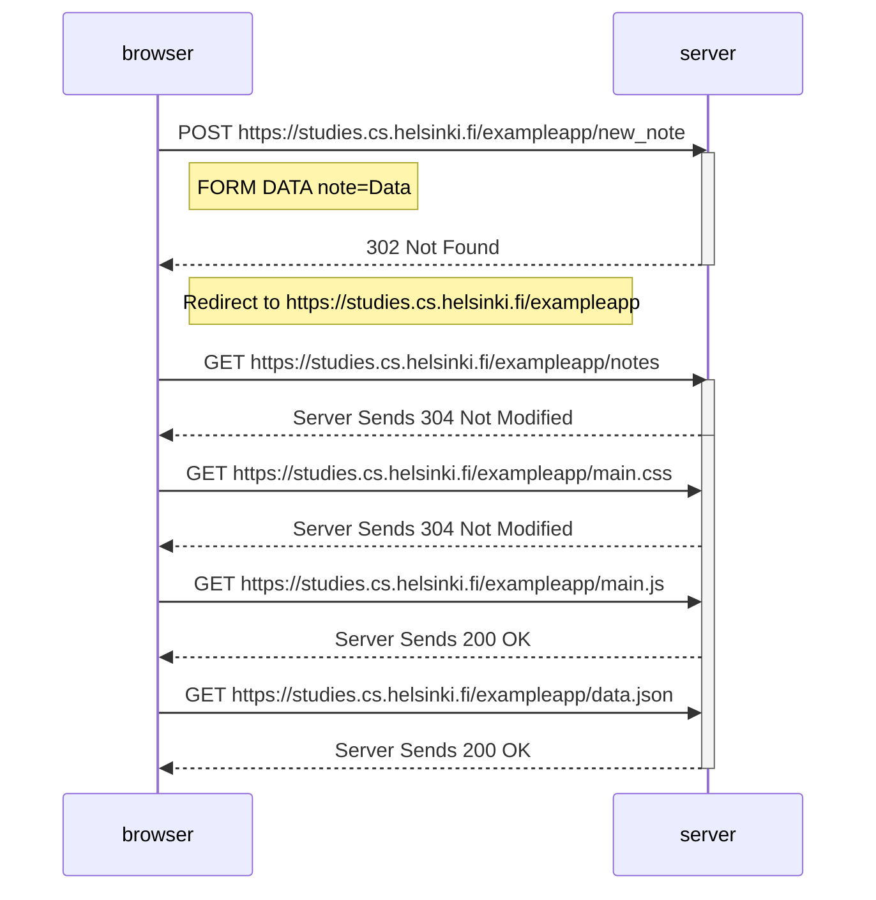

```mermaid
sequenceDiagram
    participant browser
    participant server
    
    browser->>server: POST https://studies.cs.helsinki.fi/exampleapp/new_note
    activate server
    Note right of browser: FORM DATA note=Data
    server-->>browser: 302 Not Found
    deactivate server
    Note right of browser: Redirect to https://studies.cs.helsinki.fi/exampleapp
    
    browser->>server: GET https://studies.cs.helsinki.fi/exampleapp/notes
    activate server
    server-->>browser: Server Sends 304 Not Modified
    deactivate server
    
    activate server
    
    browser->>server: GET https://studies.cs.helsinki.fi/exampleapp/main.css
    
    server-->>browser: Server Sends 304 Not Modified
    browser->>server: GET https://studies.cs.helsinki.fi/exampleapp/main.js
    
    server-->>browser: Server Sends 200 OK
    browser->>server: GET https://studies.cs.helsinki.fi/exampleapp/data.json
    server-->>browser: Server Sends 200 OK
    deactivate server
    
```