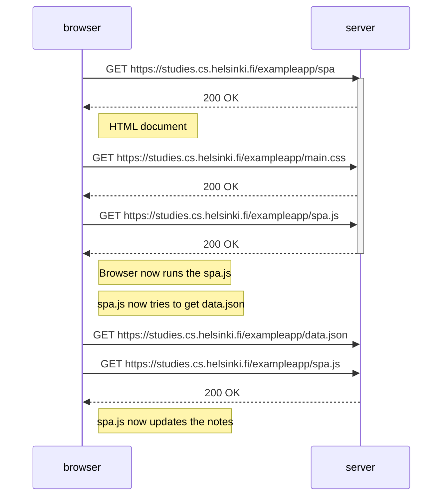

```mermaid
sequenceDiagram
    participant browser
    participant server
    
    browser->>server: GET https://studies.cs.helsinki.fi/exampleapp/spa
    activate server
    server-->>browser: 200 OK
    Note right of browser: HTML document
    browser->>server: GET https://studies.cs.helsinki.fi/exampleapp/main.css
    server-->>browser: 200 OK
    browser->>server: GET https://studies.cs.helsinki.fi/exampleapp/spa.js
    server-->>browser: 200 OK
    deactivate server
    Note right of browser: Browser now runs the spa.js
    Note right of browser: spa.js now tries to get data.json
    browser->>server: GET https://studies.cs.helsinki.fi/exampleapp/data.json
    browser->>server: GET https://studies.cs.helsinki.fi/exampleapp/spa.js
    server-->>browser: 200 OK
    Note right of browser: spa.js now updates the notes
```